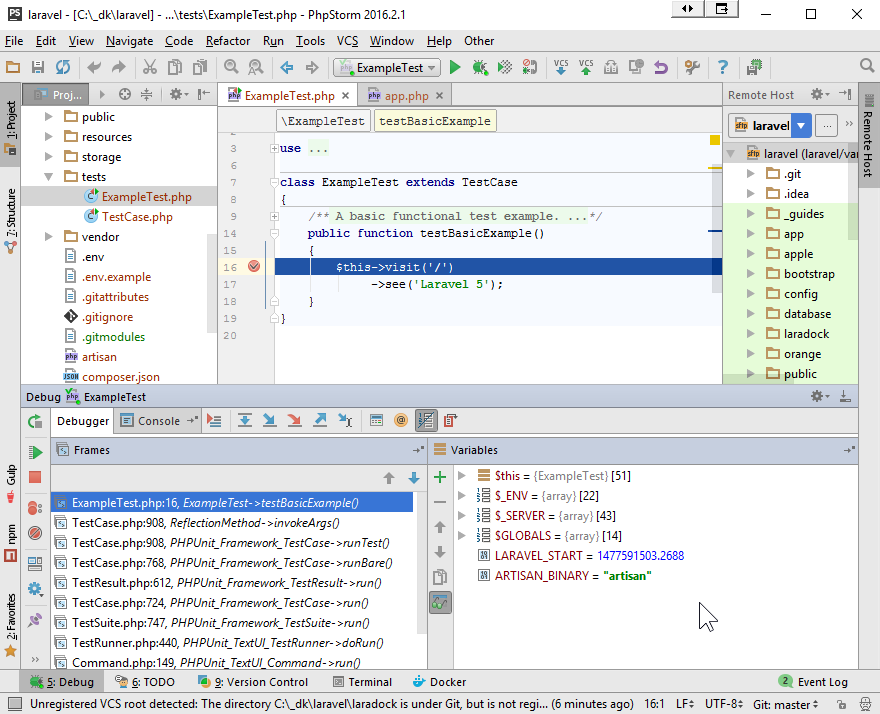

# PHPStorm Guide
Wiring up [Laravel](https://laravel.com/), [LaraDock](https://github.com/LaraDock/laradock) [Laravel+Docker] and [PHPStorm](https://www.jetbrains.com/phpstorm/) to play nice together complete with remote xdebug'ing as icing on top!


- [Intro](#Intro)
- [Installation](#Installation)
    - [Customized laradock/docker-compose.yml](#CustomizeDockerCompose) 
        - [Clean House](#InstallCleanHouse) 
        - [LaraDock Dial Tone](#InstallLaraDockDialTone) 
        - [SSH into php-fpm](#InstallLaraDockSSH) 
            - [KiTTY](#InstallKiTTY) 
    - [PHPStorm](#InstallPHPStorm)
        - [Configs](#InstallPHPStormConfigs)
- [Usage](#Usage)
    - [Laravel](#UsageLaravel) 
        - [Run ExampleTest](#UsagePHPStormRunExampleTest) 
        - [Debug ExampleTest](#UsagePHPStormDebugExampleTest) 
        - [Debug Web Site](#UsagePHPStormDebugSite) 

<a name="Intro"></a>
## Intro

This guide is based on Docker Native Windows.

<a name="Installation"></a>
## Installation

- This guide assumes the following:
    - you have already installed Laravel, LaraDock and PHPStorm and are familiar with these. 
    - you have installed Laravel at `/c/_dk/laravel`. Adjust your configurations accordingly.
    
    This guide was also written based on Docker for Windows Native. Adapt accordingly.

#### [Hosts File Editor](https://github.com/scottlerch/HostsFileEditor)
- Hosts File Editor makes it easy to change your hosts file as well as archive multiple versions for easy retrieval.
    - Set `laravel` to your docker host IP. See [Example](photos/SimpleHostsEditor/AddHost_dockerhost.png).


<a name="CustomizeWorkspace"></a>
#### Customize workspace
The LaraDock workspace container is based on [phusion/baseimage-docker](https://github.com/phusion/baseimage-docker).
This image provides support out of the box for `SSH` although it is not enabled by default.

#### Note regarding xdebug
Although xdebug is installed, it is not switched on by default. This is so that tools like `composer` will not be slowed down.
PHPStorm is configured to enable `xdebug` on-demand when running unit tests. See [PHPStorm Intepreters](https://github.com/LarryEitel/laravel-laradock-phpstorm/blob/master/screenshots/PHPStorm/Settings/LangsPHPInterpreters.png) example.

### Edit laradock/docker-compose.yml
Set the following variables:
```
### Workspace Utilities Container ###########################

    workspace:
        build:
            context: ./workspace
            args:
                - INSTALL_XDEBUG=true
                - INSTALL_WORKSPACE_SSH=true
                ...
                
                
### PHP-FPM Container #######################################

    php-fpm:
        build:
            context: ./php-fpm
            args:
                - INSTALL_XDEBUG=true
                ...
                
```

#### PHP-FPM Container
- Set: INSTALL_XDEBUG=true
    - Note: xdebug is installed but disabled until switched on. See: [Debug Web Site](#UsagePHPStormDebugSite)

<!--TODO: update screenshot-->
NOTE: PHP_IDE_CONFIG="serverName=[laravel](https://github.com/LaraDock/laradock/_guides/photos/PHPStorm/Settings/DeploymentConnection.png)" must point to a valid `Build, Execution, Deployment > Deployment > Name`.


- If your containers are currently running, let's give it a restart.
`docker-compose up -d mysql nginx`


<a name="InstallCleanHouse"></a>
### Need to clean house first?
Make sure you are starting with a clean state. For example, do you have other LaraDock containers and images?
Here are a few things I use to clean things up.

- Delete all containers using `grep laradock_` on the names, see: [Remove all containers based on docker image name](https://linuxconfig.org/remove-all-containners-based-on-docker-image-name). 
`docker ps -a | awk '{ print $1,$2 }' | grep laradock_ | awk '{print $1}' | xargs -I {} docker rm {}`

- Delete all images containing `laradock`.
`docker images | awk '{print $1,$2,$3}' | grep laradock_ | awk '{print $3}' | xargs -I {} docker rmi {}`
**Note:** This will only delete images that were built with `LaraDock`, **NOT** `laradock/*` which are pulled down by `LaraDock` such as `laradock/workspace`, etc.
**Note:** Some may fail with: 
`Error response from daemon: conflict: unable to delete 3f38eaed93df (cannot be forced) - image has dependent child images`

- I added this to my `.bashrc` to remove orphaned images.
    ```
    dclean() {
        processes=`docker ps -q -f status=exited`
        if [ -n "$processes" ]; thend
          docker rm $processes
        fi
    
        images=`docker images -q -f dangling=true`
        if [ -n "$images" ]; then
          docker rmi $images
        fi
    }
    ```

<a name="InstallLaraDockDialTone"></a>
#### Let's get a dial-tone with Laravel

```
# barebones at this point
docker-compose up -d nginx mysql

# run 
docker-compose ps

# Should see:
          Name                        Command             State                     Ports
-----------------------------------------------------------------------------------------------------------
laradock_mysql_1            docker-entrypoint.sh mysqld   Up       0.0.0.0:3306->3306/tcp
laradock_nginx_1            nginx                         Up       0.0.0.0:443->443/tcp, 0.0.0.0:80->80/tcp
laradock_php-fpm_1          php-fpm                       Up       9000/tcp
laradock_volumes_data_1     true                          Exit 0
laradock_volumes_source_1   true                          Exit 0
laradock_workspace_1        /sbin/my_init                 Up       0.0.0.0:22->22/tcp


```

<a name="InstallLaraDockSSH"></a>
#### Let's shell into workspace
Assuming that you are in laradock folder.
`ssh -i workspace/insecure_id_rsa root@laravel`

<a name="InstallKiTTY"></a>
**Cha Ching!!!!**
##### KiTTY
[Kitty](http://www.9bis.net/kitty/) KiTTY is a fork from version 0.67 of PuTTY.

- Here are some settings that are working for me:
    - 
    - 
    - 
    - 
    - 
    - 
    - 
    - 


<a name="InstallPHPStorm"></a>
### PHPStorm
PHPStorm is available as an [Early Access Program](https://confluence.jetbrains.com/display/PhpStorm/PhpStorm+Early+Access+Program). Which means it is free of charge if you don't mind a few bumps in the road.
- File/New Project

`dockerhost` was added to `etc/hosts` and points to `Docker Host IP`.


    - 


<a name="InstallPHPStormConfigs"></a>
#### Configs
- Here are some settings that work:
    - `Settings/BuildDeploymentConnectionMappings`
        - 
    
    - `Settings/DeploymentConnection`
        - 
    
    - `Settings/DeploymentMappings`
        - 
    
    - `Settings/LangsPHPInterpreters`
        - 
    
    - `Settings/LangsPHPPHPUnit`
        - 
    
    - `Settings/EditRunConfigurations`
        - 
    
    - `Settings/LangsPHPServers`
        - 
    
    - `RemoteHost`
        To switch on this view, go to: `Menu/Tools/Deployment/Browse Remote Host`.
        - 


<a name="Usage"></a>
## Usage

<a name="UsagePHPStorm"></a>
## PHPStorm
<a name="UsagePHPStormRunExampleTest"></a>
### Run ExampleTest
- right-click on `tests/ExampleTest.php`
    - Select: `Run 'ExampleTest.php'` or `Ctrl+Shift+F10`.
    - Should pass!! You just ran a remote test via SSH!

<a name="UsagePHPStormDebugExampleTest"></a>
### Debug ExampleTest
- Open to edit: `tests/ExampleTest.php`
- Add a BreakPoint on line 16: `$this->visit('/')`
- right-click on `tests/ExampleTest.php`
    - Select: `Debug 'ExampleTest.php'`.
    - Should have stopped at the BreakPoint!! You are now debugging locally against a remote Laravel project via SSH!
    - 


<a name="UsagePHPStormDebugSite"></a>
### Debug WebSite
- In case xDebug is disabled, from the `laradock` folder run: 
`./xdebugPhpFpm start`.
    - To switch xdebug off, run: 
`./xdebugPhpFpm stop`
    
- Start Remote Debugging
    -  
- Open to edit: `bootstrap/app.php`
- Add a BreakPoint on line 14: `$app = new Illuminate\Foundation\Application(`
- Reload [Laravel Site](http://laravel/)
    - Should have stopped at the BreakPoint!! You are now debugging locally against a remote Laravel project via SSH!
    - 
